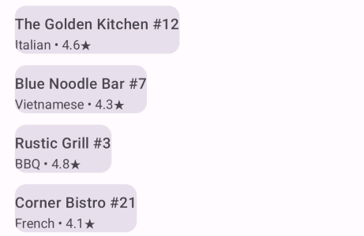
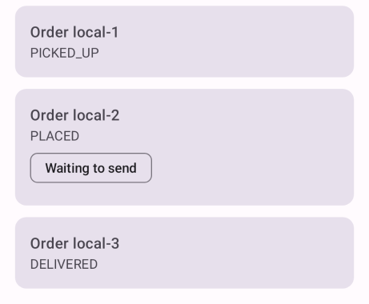
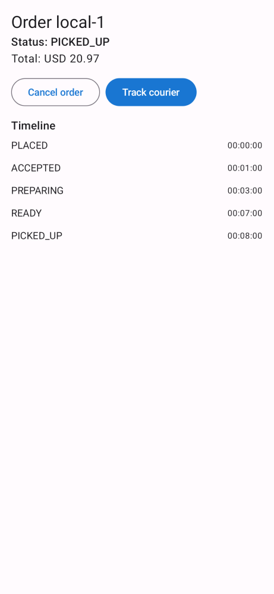
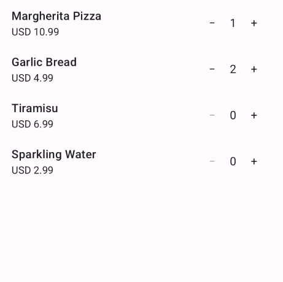
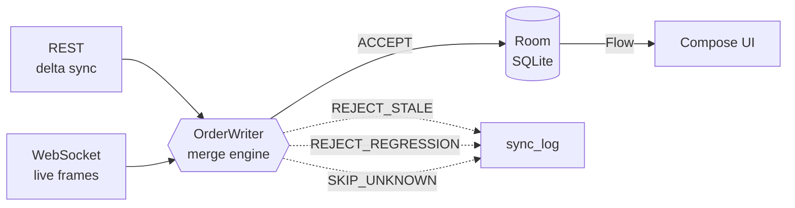
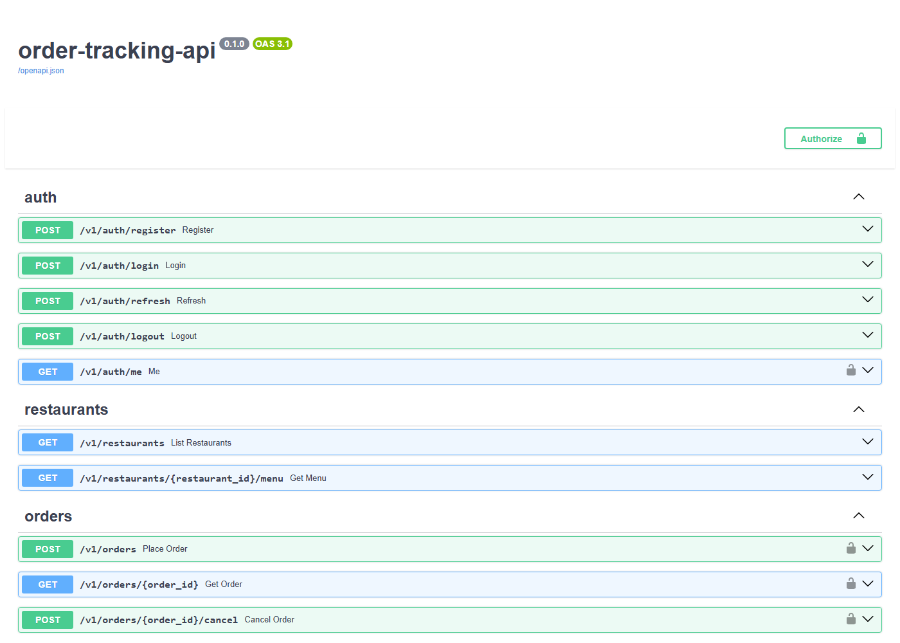

# Offline-First Order Tracking

**A food-delivery order tracker where the network is optional.** Android (Kotlin ·
Compose · Room-as-single-source-of-truth) talking to an async FastAPI backend, built
around one hard problem: *three delivery channels, no ordering guarantees, one
correct answer.*


> The network is a suggestion. Room is the truth. Every screen renders from a `Flow`
> off a DAO, and every byte that arrives from REST or the WebSocket is funnelled
> through a single writer that merges it into SQLite.

Full architecture and the reasoning behind every decision: **[DESIGN.md](./DESIGN.md)**.

---

## At a glance

| | |
|---|---|
| **Client** | 14-module Gradle graph · 95 Kotlin files · ~6.3k LOC |
| **Backend** | FastAPI + SQLAlchemy 2.0 async + Alembic · 14 endpoints · ~2.5k LOC |
| **Tests** | 63 JVM tests across 13 suites (Android) + 9 integration tests on a real Postgres (backend) |
| **Infra** | One `docker compose up` — Postgres, Redis, API, migrations |

---

## Screenshots

<table>
<tr>
<td align="center"><br/><sub><b>Feed</b></sub></td>
<td align="center"><br/><sub><b>Orders</b> — "Waiting to send"</sub></td>
<td align="center"><br/><sub><b>Order detail</b> — timeline</sub></td>
<td align="center"><br/><sub><b>Menu / cart</b></sub></td>
</tr>
</table>

Rendered straight from the production Compose code via
[Paparazzi](https://github.com/cashapp/paparazzi) — JVM-only, no emulator, no
mockups. The Maps-based tracking screen isn't shown here since a native map view
doesn't render through it; see the demo script below for what it looks like live.

---

## The interesting part: three channels, one truth

Order status arrives over **REST delta sync** and over the **WebSocket** — two
transports with two latencies and no ordering guarantee between them. The naïve
approach (last-write-wins) produces visible flicker: `PICKED_UP → PREPARING →
PICKED_UP` when a slow REST response lands after a fast WS frame.

Every inbound byte instead goes through a single `OrderWriter` merge engine:



A live WS frame carries only `order_id`, `version` and `status`, so it can't build a
full row and can't create one — `OrderWriter.applyStatus` resolves the local row by
`serverId`, overlays the two fields the frame actually knows, and then goes through
the *same* `MergeEngine.decide` a REST page does. Not a second implementation that
can drift: literally the same function.

The merge is a three-layer defence, and every rejection is logged:

1. **Version guard** — the server's per-row monotonic `version` is the primary
   defence. Anything `<=` local is stale, dropped.
2. **Status guard** — defence in depth. Order status isn't an opaque value, it's a
   position in a monotonic FSM, so a regression is rejected even if the version says
   otherwise. Terminal states (`CANCELLED`) are checked *first*, so a cancellation
   still beats a higher-ordinal `PICKED_UP`.
3. **LWW only where it's actually correct** — client-owned fields (delivery note, tip)
   where the server just echoes back what the outbox pushed.

Because the merge is idempotent by construction, a crash mid-page during delta sync
simply replays the page. That property is what makes the whole sync protocol safe.

---

## Engineering highlights

**Offline writes that survive process death.** Placing an order writes the order row
*and* its outbox row in a single Room transaction — so the "Waiting to send" badge is
never a lie. `OutboxDrainWorker` (WorkManager) drains it when connectivity returns and
reconciles the local row to a real `serverId`. A write the server rejects outright is
deferred rather than deleted — silently dropping a user's order because of a 422 is
unacceptable — and the "Failed" badge re-arms that same entry, so "deferred" and
"deleted" aren't the same outcome with different bookkeeping.

**Idempotency that actually holds.** Every outbound write carries a client-generated
`Idempotency-Key`; the backend persists keys and replays the original response. Fire
the same `POST /v1/orders` twice and you get the same `serverId`, and the merge engine
records the second one as a no-op instead of a duplicate order.

**A delta-sync protocol that doesn't trust the device clock.** `GET /v1/sync` uses an
**opaque server cursor** encoding a keyset `(updated_at, id)` tuple — not a
client-supplied timestamp. Keyset pagination (not `OFFSET`) means rows mutating
mid-scan can't cause skips. Deletions ride the same protocol as tombstones
(`deleted: true`) rather than as absences — an absent row is indistinguishable from
"unchanged since your cursor", so being gone has to be an explicit fact on the wire.
Note that a *cancelled* order is not a deleted one: it stays in the user's history.

**Sync triggers that collapse under load.** App foreground, a 15-minute periodic tick,
pull-to-refresh, and WS-sequence-gap detection all enqueue the *same* unique work name
with `KEEP` — so a burst collapses into one sync run. Pull-to-refresh is the one
exception, using `REPLACE`, because the user explicitly asked for a fresh one.

**WebSocket as an accelerator, never as truth.** Live frames make the UI feel instant,
but they're merged through the same guard as everything else. Every published frame
carries a per-order `seq` stamped by a Redis `INCR` — process-local counters would
collide across workers — and a detected gap just triggers a delta sync. The socket is
never load-bearing for correctness.

**Motion that looks real.** The courier marker interpolates along the polyline between
1 Hz updates rather than teleporting, with a follow-camera that yields the moment the
user pans it themselves.

**The invisible engine, made visible.** A built-in sync-log drawer shows every merge
decision this session made — `ACCEPT`, `REJECT_STALE`, `REJECT_REGRESSION`. Silent
conflict resolution is unobservable and therefore undebuggable.

---

## Stack

**Android** — Kotlin, Jetpack Compose (Material 3), Room, WorkManager, Paging 3,
DataStore, Retrofit/OkHttp, Coroutines + Flow, Maps SDK.

**Backend** — FastAPI, SQLAlchemy 2.0 (async), Alembic, PostgreSQL, Redis pub/sub,
JWT auth with refresh-token rotation, Pydantic v2, pytest + Testcontainers.

## Repo layout

```
backend/    FastAPI + SQLAlchemy async + Alembic + Redis (Docker Compose)
android/    Gradle multi-module Compose client

  core/model  core/common  core/database  core/datastore
  core/network  core/data  core/designsystem
  sync/       outbox drain + delta sync workers
  feature/orders  feature/tracking  feature/feed  feature/menu
  app/        shell, navigation, DI container
```

The module graph enforces the architecture: `:feature:feed`, `:feature:menu` and
`:feature:orders` have no dependency on `:core:network` at all, so no screen can
accidentally bypass Room and render straight off a network response.
`:feature:tracking` is the deliberate exception — it owns the WebSocket connection —
and it still writes only through `OrderWriter`.

---

## Quickstart

```bash
docker compose up --build
```

That brings up Postgres, Redis, a one-shot `migrate` service running `alembic upgrade
head`, and the API — which waits on the migration completing successfully, so the
first request can never hit an unmigrated database. No `.env` needed: every setting in
`app/core/config.py` has a working development default, and compose overrides only the
two service addresses that actually differ inside its network.

API docs at `http://localhost:8000/docs`:



Seed some demo data — simplest inside the running container, which already has the
dependencies and the right `DATABASE_URL`:

```bash
docker compose exec api python -m scripts.seed --reset --count 50
```

Restaurants and menu items only; there is no seeded user. Create an account through
the app's own register screen — that is the intended first step.

Then build the client:

```bash
cd android && ./gradlew assembleDebug
```

### Running it on an emulator

`AppContainer` points at `http://10.0.2.2:8000` — the Android emulator's alias for the
host machine's localhost — so the app expects **the emulator, not a physical device**.
On a device, change `BASE_URL`/`WS_URL` to the host's LAN address and add that address
to `res/xml/network_security_config.xml`.

That config exists because `targetSdk 34` blocks cleartext HTTP by default. Cleartext
is permitted for the loopback addresses only, rather than flipping
`usesCleartextTraffic` on the whole app, so a future build pointing at a production
host can't silently downgrade.

### Optional credentials

Real map tiles need a `MAPS_API_KEY` in `android/local.properties`; it's gitignored,
and **the project builds and every test passes without it** — it only affects what
renders at runtime, not correctness. The tracking screen additionally needs an
emulator image with **Google APIs** (Play services), since `GoogleMap` won't
initialise without them. It is the one screen no automated test covers — Paparazzi
renders Compose on the JVM and a native `MapView` isn't Compose — so it's worth a dry
run before demoing.

Push is backend-only today: `push_service` builds a *data-only* FCM message (never a
`notification` block, so a payload the client hasn't validated can't post a
notification on its own) and logs instead of sending unless `FIREBASE_CREDENTIALS_PATH`
is set. There is no client-side receiver — see scope boundaries below.

## Tests

```bash
cd backend && python -m pytest tests/ -v   # Testcontainers spins up a throwaway Postgres
cd android && ./gradlew test               # all 14 modules, JVM only, no emulator
```

The Android suite runs entirely on the JVM via Robolectric — DAOs, ViewModels, the
merge engine, and WorkManager (via `TestListenableWorkerBuilder`) — which keeps the
whole thing deterministic and CI-friendly with no device farm in the loop.

---

## Driving a demo

`demo/` is a self-contained harness for showing the app live. It is additive --
nothing in it changes how the app or backend behave unless you invoke it
explicitly. It needs no Google Maps API key, because it demonstrates the status
ladder through the orders screens and the sync log rather than the map.

Stdlib Python only, no venv:

```bash
python demo/drive_demo.py status
```

### Why it exists

Two things make the flow awkward to show unaided:

- The backend walks an order up the ladder on its own timers
  (8s/8s/12s/8s). That is either too fast to narrate or too slow to watch.
- Live status frames arrive over the WebSocket, which is scoped to the
  tracking screen's ViewModel -- the one screen that needs a Maps key. On the
  orders list and order detail, status converges via **delta sync**, whose only
  practical trigger during a demo is app foreground. The harness performs that
  foreground cycle over `adb` for you.

### Optional: take the timers out of the loop

For a demo where every transition is one you triggered, start the stack with the
overlay. The base compose file is untouched; drop the second `-f` to go back.

```bash
docker compose -f docker-compose.yml -f demo/docker-compose.demo.yml up -d
```

### The commands

| Command | Does |
|---|---|
| `python demo/drive_demo.py status` | Recent orders, their versions, and the ladder |
| `python demo/drive_demo.py step` | Advance one rung, then foreground the app so it syncs |
| `python demo/drive_demo.py run` | Advance all the way to `DELIVERED`, then sync once |
| `python demo/drive_demo.py refresh` | Just foreground the app to force a delta sync |

`--order <uuid>` targets a specific order instead of the newest. `--no-phone`
skips every `adb` step and drives the backend alone.

`step` is the one to use live -- one rung, one sync, one thing to say about each.
`run` is for a fast end-to-end sanity check before anyone is watching.

```
$ python demo/drive_demo.py step
PLACED -> ACCEPTED
  PLACED->[ACCEPTED]->preparing->ready->picked_up->delivered
  phone foregrounded -> delta sync enqueued
```

### Watching it land on the device

The status change is server-side until the phone syncs. `step` foregrounds the
app for you, which is what fires `SyncManager.onAppForeground()`; give it a few
seconds, then look at the order detail screen -- the status line and the timeline
both update straight off the Room `Flow`, with nothing telling them to refresh.

The **Sync log** button on the orders screen is the payoff: every merge decision
of the session, `ACCEPT` / `REJECT_STALE` / `REJECT_REGRESSION`, with the version
that produced it.

For the strongest version, keep the backend log visible in a second window --
zero requests while the device is offline, then the writes landing on reconnect:

```bash
docker compose logs -f api
```

---

## 3-minute demo script

0. **Sign in once, online.** A fresh install opens on the login screen and "Create
   account" registers against `POST /v1/auth/register`. This is the one step that
   genuinely needs the network: without a token there is no authenticated request to
   queue, so there is nothing for the outbox to be offline-first *about*. Every step
   below happens after this, and the session survives process death.
1. **Cold start, offline.** Relaunch in airplane mode. Feed and existing orders render
   immediately from Room — nothing spins waiting for a network that isn't there.
2. **Place an order offline.** It appears instantly, badged "Waiting to send". Kill the
   app, reopen it — still there, still pending, because it and its outbox row landed in
   one transaction.
3. **Reconnect.** The badge clears on its own: the outbox drained, the order reconciled
   to a real `serverId`, Room emitted the update. Nobody refreshed anything.
4. **Force the duplicate case.** Grab the idempotency key from the sync log, curl
   `POST /v1/orders` again with it — same `serverId` back, logged as a no-op merge.
5. **Watch it move.** `POST /v1/dev/orders/{id}/advance` (or just wait for the timers).
   Status updates land over the WebSocket in under a second.
6. **Tracking.** Once `PICKED_UP`, the courier marker walks the polyline smoothly with
   a follow-camera that backs off when you pan.
7. **Open the sync log.** Every merge decision of the session, in order. The invisible
   engine made visible in fifteen seconds.

---

## Build history

Built in 10 phases, each ending at a demonstrable gate rather than a "it compiles"
checkpoint — see [DESIGN.md §17](./DESIGN.md#17-build-phases-with-validation-gates).

| # | Phase | |
|---|---|---|
| 1 | Repo scaffolding | ✅ |
| 2 | Backend foundation (config, models, migrations, auth) | ✅ |
| 3 | Backend orders & delta sync | ✅ |
| 4 | Backend realtime (WebSocket, Redis pub/sub, courier simulator) | ✅ |
| 5 | Android core modules (model, common, database, datastore) | ✅ |
| 6 | Android network & data layer (repositories, `OrderWriter` merge engine) | ✅ |
| 7 | Android offline write path (outbox, `WorkManager`) | ✅ |
| 8 | Android orders + tracking features (maps, push plumbing) | ✅ |
| 9 | Android feed + menu + app shell | ✅ |
| 10 | Testing, debug drawer, docs & demo script | ✅ |

---

## Scope boundaries (deliberate)

Decisions made on purpose, with the reasoning — see [DESIGN.md §18](./DESIGN.md) for
the longer version.

- **Constructor injection, wired by hand.** `:app`'s `AppContainer` composes the graph
  explicitly. Every class already takes its dependencies through its constructor in
  exactly the shape a DI framework would inject — so adopting Hilt is a mechanical
  annotation pass, not a redesign. Retrofitting it across five phases of already-tested
  modules was churn against working code, not architecture.
- **JVM-only verification.** Testing is Robolectric-on-JVM throughout, chosen for
  deterministic, emulator-free CI. Compose screens are exercised through their
  ViewModels; they haven't been visually verified on a physical device.
- **Single-device sync model.** No per-device sync cursors, and client-owned fields
  (delivery note, tip) use plain LWW. Multi-device would need per-device cursors and a
  stronger convergence story for those fields — a known extension point, scoped out
  rather than half-built.
- **Push is a backend capability, not a client one.** The server sends data-only FCM
  messages and the outbox already carries a generic `fcm_token` registration entry, but
  there is no `FirebaseMessagingService` on the client and no token is ever registered.
  Wiring it is a third caller of `OrderWriter.applyStatus` — the same shape the
  WebSocket path already takes — rather than new architecture.
- **The WebSocket is scoped to the tracking screen's ViewModel**, so live status frames
  merge only while that screen is open. Every other screen converges via delta sync.
  Hoisting the socket to a process-lifecycle-scoped service is the obvious next step.
- **Single-worker deployment.** The Redis fanout exists precisely so a status published
  by one worker reaches a socket held by another, but compose runs one API container —
  the multi-worker path is designed for and unproven.
</content>
</invoke>
