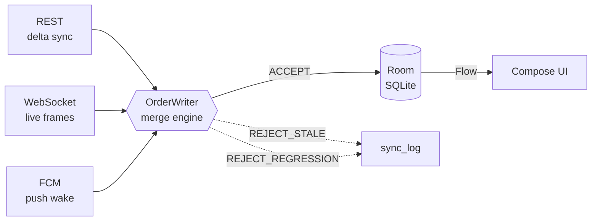

# Offline-First Order Tracking

**A food-delivery order tracker where the network is optional.** Android (Kotlin ·
Compose · Room-as-single-source-of-truth) talking to an async FastAPI backend, built
around one hard problem: *three delivery channels, no ordering guarantees, one
correct answer.*


> The network is a suggestion. Room is the truth. Every screen renders from a `Flow`
> off a DAO, and every byte that arrives from REST, WebSocket, or FCM is funnelled
> through a single writer that merges it into SQLite.

Full architecture and the reasoning behind every decision: **[DESIGN.md](./DESIGN.md)**.

---

## At a glance

| | |
|---|---|
| **Client** | 13-module Gradle graph · 88 Kotlin files · ~4.7k LOC |
| **Backend** | FastAPI + SQLAlchemy 2.0 async + Alembic · 14 endpoints · ~2.5k LOC |
| **Tests** | 34 JVM tests across 10 suites (Android) + 9 integration tests on a real Postgres (backend) |
| **Infra** | One `docker compose up` — Postgres, Redis, API, migrations |

---

## The interesting part: three channels, one truth

Order status arrives over **REST**, **WebSocket**, and **FCM** — three transports with
three latencies and no ordering guarantee between them. The naïve approach
(last-write-wins) produces visible flicker: `PICKED_UP → PREPARING → PICKED_UP` when a
slow REST response lands after a fast WS frame.

Every inbound byte instead goes through a single `OrderWriter` merge engine:



The merge is a three-layer defence, and every rejection is logged:

1. **Version guard** — the server's per-row monotonic `version` is the primary
   defence. Anything `<=` local is stale, dropped.
2. **Status guard** — defence in depth. Order status isn't an opaque value, it's a
   position in a monotonic FSM, so a regression is rejected even if the version says
   otherwise. Terminal states (`CANCELLED`) are checked *first*, so a cancellation
   still beats a higher-ordinal `PICKED_UP`.
3. **LWW only where it's actually correct** — client-owned fields (delivery note, tip)
   where the server just echoes back what the outbox pushed.

Because the merge is idempotent by construction, a crash mid-page during delta sync
simply replays the page. That property is what makes the whole sync protocol safe.

---

## Engineering highlights

**Offline writes that survive process death.** Placing an order writes the order row
*and* its outbox row in a single Room transaction — so the "Waiting to send" badge is
never a lie. `OutboxDrainWorker` (WorkManager) drains it when connectivity returns and
reconciles the local row to a real `serverId`.

**Idempotency that actually holds.** Every outbound write carries a client-generated
`Idempotency-Key`; the backend persists keys and replays the original response. Fire
the same `POST /v1/orders` twice and you get the same `serverId`, and the merge engine
records the second one as a no-op instead of a duplicate order.

**A delta-sync protocol that doesn't trust the device clock.** `GET /v1/sync` uses an
**opaque server cursor** encoding a keyset `(updated_at, id)` tuple — not a
client-supplied timestamp. Keyset pagination (not `OFFSET`) means rows mutating
mid-scan can't cause skips, and tombstones (`deleted: true`) keep cancelled rows from
living forever in the client cache.

**Sync triggers that collapse under load.** Foreground, FCM wake, 15-min periodic,
pull-to-refresh, and WS-sequence-gap detection all enqueue the *same* unique work name
with `KEEP` — so a burst of five push messages collapses into one sync run.

**WebSocket as an accelerator, never as truth.** Live frames make the UI feel instant,
but they're merged through the same guard as everything else. A detected `seq` gap
just triggers a delta sync; the socket is never load-bearing for correctness.

**Motion that looks real.** The courier marker interpolates along the polyline between
1 Hz updates rather than teleporting, with a follow-camera that yields the moment the
user pans it themselves.

**The invisible engine, made visible.** A built-in sync-log drawer shows every merge
decision this session made — `ACCEPT`, `REJECT_STALE`, `REJECT_REGRESSION`. Silent
conflict resolution is unobservable and therefore undebuggable.

---

## Stack

**Android** — Kotlin, Jetpack Compose (Material 3), Room, WorkManager, Paging 3,
DataStore, Retrofit/OkHttp, Coroutines + Flow, Maps SDK, Firebase Messaging.

**Backend** — FastAPI, SQLAlchemy 2.0 (async), Alembic, PostgreSQL, Redis pub/sub,
JWT auth with refresh-token rotation, Pydantic v2, pytest + Testcontainers.

## Repo layout

```
backend/    FastAPI + SQLAlchemy async + Alembic + Redis (Docker Compose)
android/    Gradle multi-module Compose client

  core/model  core/common  core/database  core/datastore
  core/network  core/data  core/designsystem
  sync/       outbox drain + delta sync workers
  feature/orders  feature/tracking  feature/feed  feature/menu
  app/        shell, navigation, DI container
```

The module graph enforces the architecture: `:feature:*` can't reach `:core:network`,
so no screen can accidentally bypass Room and render straight off a network response.

---

## Quickstart

```bash
docker compose up --build
```

API docs at `http://localhost:8000/docs`. Then:

```bash
cd android && ./gradlew assembleDebug
```

Seed some demo data:

```bash
cd backend
python -m scripts.seed --reset --count 500
```

### Optional credentials

Real map tiles need a `MAPS_API_KEY` in `android/local.properties`, and deliverable
push needs a Firebase `google-services.json` in `android/app/`. Both are gitignored,
and **the project builds and every test passes without either** — they only affect
what renders at runtime, not correctness.

## Tests

```bash
cd backend && python -m pytest tests/ -v   # Testcontainers spins up a throwaway Postgres
cd android && ./gradlew test               # all 13 modules, JVM only, no emulator
```

The Android suite runs entirely on the JVM via Robolectric — DAOs, ViewModels, the
merge engine, and WorkManager (via `TestListenableWorkerBuilder`) — which keeps the
whole thing deterministic and CI-friendly with no device farm in the loop.

---

## 3-minute demo script

1. **Cold start, offline.** Launch in airplane mode. Feed and existing orders render
   immediately from Room — nothing spins waiting for a network that isn't there.
2. **Place an order offline.** It appears instantly, badged "Waiting to send". Kill the
   app, reopen it — still there, still pending, because it and its outbox row landed in
   one transaction.
3. **Reconnect.** The badge clears on its own: the outbox drained, the order reconciled
   to a real `serverId`, Room emitted the update. Nobody refreshed anything.
4. **Force the duplicate case.** Grab the idempotency key from the sync log, curl
   `POST /v1/orders` again with it — same `serverId` back, logged as a no-op merge.
5. **Watch it move.** `POST /v1/dev/orders/{id}/advance` (or just wait for the timers).
   Status updates land over the WebSocket in under a second.
6. **Tracking.** Once `PICKED_UP`, the courier marker walks the polyline smoothly with
   a follow-camera that backs off when you pan.
7. **Open the sync log.** Every merge decision of the session, in order. The invisible
   engine made visible in fifteen seconds.

---

## Build history

Built in 10 phases, each ending at a demonstrable gate rather than a "it compiles"
checkpoint — see [DESIGN.md §17](./DESIGN.md#17-build-phases-with-validation-gates).

| # | Phase | |
|---|---|---|
| 1 | Repo scaffolding | ✅ |
| 2 | Backend foundation (config, models, migrations, auth) | ✅ |
| 3 | Backend orders & delta sync | ✅ |
| 4 | Backend realtime (WebSocket, Redis pub/sub, courier simulator) | ✅ |
| 5 | Android core modules (model, common, database, datastore) | ✅ |
| 6 | Android network & data layer (repositories, `OrderWriter` merge engine) | ✅ |
| 7 | Android offline write path (outbox, `WorkManager`) | ✅ |
| 8 | Android orders + tracking features (maps, FCM) | ✅ |
| 9 | Android feed + menu + app shell | ✅ |
| 10 | Testing, debug drawer, docs & demo script | ✅ |

---

## Scope boundaries (deliberate)

Decisions made on purpose, with the reasoning — see [DESIGN.md §18](./DESIGN.md) for
the longer version.

- **Constructor injection, wired by hand.** `:app`'s `AppContainer` composes the graph
  explicitly. Every class already takes its dependencies through its constructor in
  exactly the shape a DI framework would inject — so adopting Hilt is a mechanical
  annotation pass, not a redesign. Retrofitting it across five phases of already-tested
  modules was churn against working code, not architecture.
- **JVM-only verification.** Testing is Robolectric-on-JVM throughout, chosen for
  deterministic, emulator-free CI. Compose screens are exercised through their
  ViewModels; they haven't been visually verified on a physical device.
- **Single-device sync model.** No per-device sync cursors, and client-owned fields
  (delivery note, tip) use plain LWW. Multi-device would need per-device cursors and a
  stronger convergence story for those fields — a known extension point, scoped out
  rather than half-built.
</content>
</invoke>
